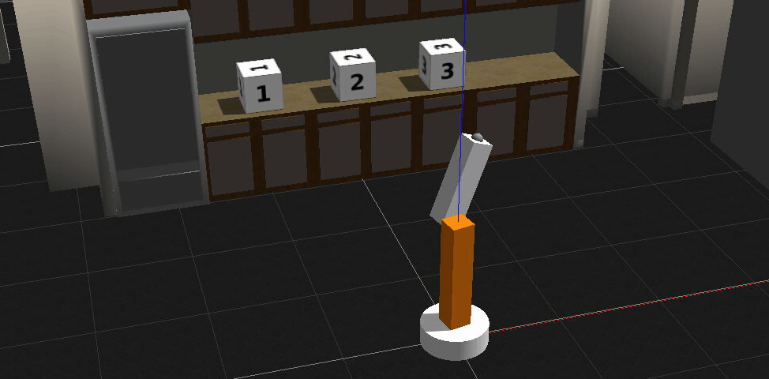

# Writing ROS Nodes

In [the previous lesson](https://github.com/A2Amir/Catkin-Workspace-for-ROS) I've created a Catkin workspace and added the simple arm package to it, 
In this lesson, I will be writing nodes in Python that publish and subscribe to topics and write a Ross service that can be called from other nodes or from the command line.

* The first node that I will be writing is called simple mover. The simple mover node does nothing more than publish joint angle commands to simple arm.

* The next node called arm mover. The arm mover node provides a service called safe move, which allows the arm to be moved to any position within its workspace, which has been deemed to be safe. The safe zone is bounded by minimum and maximum joint angles and it's configurable via the Ross parameter server.

* The last node I will write in this lesson, is the look away node.  This node subscribes to a topic where camera data is being published. When the camera detects an image with uniform color meaning that it's looking at the sky, the node will call the safe move service to move the arm to a new position.

# 1. ROS Publishers

### Defining Publishers

Before seeing the code for **simple_mover**, it may be helpful to see how ROS Publishers work in Python. Publishers allow a node to send messages to a topic, so that data from the node can be used in other parts of the ROS system. In Python, ROS publishers typically have the following definition format, although other parameters and arguments are possible:

    pub1 = rospy.Publisher("/topic_name", message_type, queue_size=size)

* **Synchronous publishing** means that a publisher will attempt to publish to a topic but may be blocked if that topic is being published to by a different publisher. In this situation, the second publisher is blocked until the first publisher has serialized all messages to a buffer and the buffer has written the messages to each of the topic's subscribers. This is the default behavior of a rospy Publisher **if the queue_size parameter is not used or set to None**.

* **Asynchronous publishing** means that a publisher can store messages in a queue until the messages can be sent. If the number of messages published exceeds the size of the queue, the oldest messages are dropped. **The queue size can be set using the queue_size parameter**.

### Using Publishers

Once the publisher has been created as above, a message with the specified data type can be published as follows:
	  
    pub1.publish(message)
 
Note:Choosing a good **queue_size** is somewhat subjective, setting queue_size=0 actually creates an infinite queue. This could lead to memory leakage if the messages are published faster than they are picked up. providing a little room for messages to queue without being too large, is a good choice.

### Simple Mover: The Code

Below is the Explanation of the code for **[the simple_mover node](https://github.com/A2Amir/Writing-ROS-Nodes/blob/master/Code/simple_mover.py)**, followed by a step-by-step explanation of what is happening. 

First, open a new terminal, next: 

	1. cd ~/catkin_ws/src/simple_arm/
	2. mkdir scripts
	3. cd scripts
	4. touch simple_mover
	5. nano simple_mover

6. I have opened the simple_mover script with the nano editor, now copy 
	and paste the code from**[the simple_mover node](https://github.com/A2Amir/Writing-ROS-Nodes/blob/master/Code/simple_mover.py)** into the script and use ctrl-x followed by y then enter to save the script.

7. chmod u+x simple_mover
 
### The code: Explained


```python
#!/usr/bin/env python

import math
import rospy
from std_msgs.msg import Float64
```

rospy is the official Python client library for ROS. It provides most of the fundamental functionality required for interfacing with ROS via Python. It has interfaces for creating Nodes, interfacing with Topics, Services, Parameters and more. It will certainly be worth your time to check out the API documentation [here](http://docs.ros.org/kinetic/api/rospy/html/). General information about rospy, including other tutorials may be found on the [ROS Wiki](http://wiki.ros.org/rospy_tutorials/Tutorials/WritingPublisherSubscriber).


```python
from std_msgs.msg import Float64
```

From the std_msgs package, I import Float64, which is one of the primitive message types in ROS. The [std_msgs](http://wiki.ros.org/std_msgs) package also contains all of the other primitive types. Later on in this script, I will be publishing Float64 messages to the position command topics for each joint.


```python
def mover():
    pub_j1 = rospy.Publisher('/simple_arm/joint_1_position_controller/command',
                             Float64, queue_size= 10)
    pub_j2 = rospy.Publisher('/simple_arm/joint_2_position_controller/command',
                             Float64, queue_size=10)
```

At the top of the mover function, two publishers are declared, one for joint 1 commands, and one for joint 2 commands. Here, the queue_size parameter is used to determine the maximum number messages that may be stored in the publisher queue before messages are dropped. More information about this parameter can be found [here](http://wiki.ros.org/rospy/Overview/Publishers and Subscribers#queue_size:_publish.28.29_behavior_and_queuing).


```python
 rospy.init_node('arm_mover')
```

Initializes a client node and registers it with the master. Her **arm_mover** is the name of the node. init_node() must be called before any other rospy package functions are called. The argument anonymous=True makes sure that you always have a unique name for your node.


```python
 rate = rospy.Rate(10)
```

The rate object is created here with a value of 10 Hertz. Rates are used to limit the frequency at which certain loops (for example publishing at a frequency of 10Hz) spin in ROS . Choosing a rate which is too high may result in unnecessarily high CPU usage, while choosing a value too low could result in high overall system latency. Choosing sensible values for all of the nodes in a ROS system is a bit of a fine-art.


```python
start_time = 0

    while not start_time:
        start_time = rospy.Time.now().to_sec()

```

start_time is used to determine how much time has elapsed. When using ROS with simulated time (as I am doing here), rospy.Time.now() will initially return 0, until the first message has been received on the /clock topic. This is why start_time is set and polled continuously until a nonzero value is returned (more information [here](http://wiki.ros.org/rospy/Overview/Time)). 


```python

    while not rospy.is_shutdown():
        elapsed = rospy.Time.now().to_sec() - start_time
        pub_j1.publish(math.sin(2*math.pi*0.1*elapsed)*(math.pi/2))
        pub_j2.publish(math.sin(2*math.pi*0.1*elapsed)*(math.pi/2))
        rate.sleep()

```

This the main loop. Due to the call to rate.sleep(), the loop is traversed at approximately 10 Hertz. Each trip through the body of the loop will result in two joint command messages being published. The joint angles are sampled from a sine wave with a period of 10 seconds, and in magnitude from [−π/2,+π/2-\pi/2, +\pi/2−π/2,+π/2]. When the node receives the signal to shut down (either from the master, or via SIGINT signal in a console window), the loop will be exited.


```python
if __name__ == '__main__':
    try:
        mover()
    except rospy.ROSInterruptException:
        pass
```
If the name variable is set to “main”, indicating that this script is being executed directly, the mover() function will be called. The try/except blocks here are significant as rospy uses exceptions extensively. The particular exception being caught here is the ROSInterruptException. This exception is raised when the node has been signaled for shutdown. If there was perhaps some sort of cleanup needing to be done before the node shuts down, it would be done here. More information about rospy exceptions can be found [here](http://wiki.ros.org/rospy/Overview/Exceptions).

#### Running simple_mover code

Assuming that my workspace has recently been built and it’s setup.bash has been sourced, I can launch simple_arm as follows:

	cd ~/catkin_ws
	roslaunch simple_arm robot_spawn.launch
	
Once ROS Master, Gazebo, and all of our relevant nodes are up and running, I can finally launch simple_mover. To do so, open a new terminal and type the following commands:

	cd ~/catkin_ws
	source devel/setup.bash
	rosrun simple_arm simple_mover
	
Below is a gif showing what the expected movements should look like.

<p align="right">

<p align="center">

# 2. ROS Services

### Defining services

In this section I am going to code an another node called **arm_mover** which implements the **safe_move** service to allow the arm to be controlled with service calls.

A ROS service allows request/response communication between nodes. Within the node providing the service, request messages are handled by functions or methods. Once the requests have been handled successfully, the node providing the service sends a message back to the requester node. 

In Python, a ROS service can be created using the following definition format:

	service = rospy.Service('service_name', serviceClassName, handler)

Here, the **service_name** is the name given to the service. Other nodes will use this name to specify which service they are sending requests to. Each service has a definition provided in an .srv file. This is a text file that provides the proper message type for both requests and responses and the **serviceClassName** comes from this file name where the service definition exists.

The **handler** is the name of the function or method that handles the incoming service message. This function is called each time the service is called and the message from the service call is passed to the handler as an argument. The handler should return an appropriate service response message.


### Using Services

Services can be called directly from the command line and I will show you an example of this in the upcoming arm_mover concepts. On the other hand, to use a ROS service from within another node, I will define a ServiceProxy, which provides the interface for sending messages to the service:

	service_proxy = rospy.ServiceProxy('service_name', serviceClassName)

One way the ServiceProxy can then be used to send requests is as follows:

	msg = serviceClassNameRequest()
	response = service_proxy(msg)

In the code above, a new service message is created by calling the serviceClassNameRequest() method. This method is provided by rospy and its name is given by appending Request() to the name used for serviceClassName. Since the message is new, the message attributes should be updated to have the appropriate data. Next, the service_proxy can be called with the message and the response stored.

For other ways to pass data to service_proxy, see the ROS documentation [here](http://wiki.ros.org/rospy/Overview/Services).

### Description of Arm Mover

In many respects, arm_mover is quite similar to simple_mover. Like simple_mover, it is responsible for commanding the arm to move. However, instead of simply commanding the arm to follow a predetermined trajectory, the arm_mover node provides the service move_arm, which allows other nodes in the system to send movement_commands.

In addition to allowing movements via a service interface, arm_mover also allows for configurable minimum and maximum joint angles, by using parameters.


### Creating a new service definition

As learned earlier, an interaction with a service consists of two messages being passed. A request passed to the service, and a response received from the service. The definitions of the request and response message type are contained within .srv files living in the srv directory under the package’s root.

Let’s define a new service for simple_arm. I call it GoToPosition.

	cd ~/catkin_ws/src/simple_arm/
	mkdir srv
	cd srv
	touch GoToPosition.srv
	nano GoToPosition.srv
	
I should now add into GoToPosition.srv, following:
	
	float64 joint_1
	float64 joint_2
	---
	duration time_elapsed
	
Then use use ctrl-x followed by y then enter to save the script

**Service definitions always contain two sections, separated by a ‘---’ line.**

* The first section is the definition of the request message. Here, a request consists of two float64 fields, one for each of simple_arm’s joints. 

* The second section contains is the service response. The response contains only a single field, time_elapsed. The time_elapsed field is of type duration and is responsible for indicating how long it took the arm to perform the movement.

Note: Defining a custom message type is very similar, with the only differences being that message definitions live within the msg directory of the package root, have a “.msg” extension, rather than .srv, and do not contain the “---” section divider. You can find more detailed information on creating messages and services [here](http://wiki.ros.org/msg) and [here](http://wiki.ros.org/srv) respectively.

### Modifying CMakeLists.txt

In order for catkin to generate the python modules or C++ libraries which allow to utilize messages in my code I must first modify simple_arm’s CMakeLists.txt (~/catkin_ws/src/simple_arm/CMakeLists.txt).

	cd ~/catkin_ws/src/simple_arm/ 	
	nano   CMakeLists.txt

CMake is the build tool underlying catkin and CMakeLists.txt is nothing more than a CMake script used by catkin. If you’re familiar with GNU make and the concept of makefiles, this is a similar concept.

First, ensure that the find_package() macro lists std_msgs and message_generation as required packages. The find_package() macro should look as follows:

	find_package(catkin REQUIRED COMPONENTS
		std_msgs
		message_generation
	)
	
As the names might imply, the std_msgs package contains all of the basic message types, and message_generation is required to generate message libraries for all the supported languages (cpp, lisp, python, javascript). 
Next, uncomment the commented-out add_service_files() macro so it looks like this:

	## Generate services in the 'srv' folder
	add_service_files(
	   FILES
	   GoToPosition.srv
	)

This tells catkin which files to generate code for. Lastly, make sure that the generate_messages() macro is uncommented, as follows:

	generate_messages(
	   DEPENDENCIES
	   std_msgs  # Or other packages containing msgs
	)

This macro is actually responsible for generating the code. For more information about CMakeLists.txt check out [this page](http://wiki.ros.org/catkin/CMakeLists.txt) on the ROS wiki.


Then use use ctrl-x followed by y then enter to save the changes in the CMakeLists.txt file.

### Modifying package.xml

Now that the CMakeLists.txt file has been covered, I should technically be able to build the project. However, there’s one more file which needs to be modified, package.xml. package.xml is responsible for defining many of the package’s properties, such as the name of the package, version numbers, authors, maintainers, and dependencies.

When worring about the dependencies check in [the previous lesson](https://github.com/A2Amir/Catkin-Workspace-for-ROS), which was about build-time dependencies and run-time package dependencies. When **rosdep** is searching for these dependencies, it’s the package.xml file that is being parsed. Let’s add the message_generation and message_runtime dependencies.

            cd ~/catkin_ws/src/simple_arm/ 	
	    nano   package.xml
	    add into package.xml:
	    
		 <build_depend>message_generation</build_depend>
 		 <run_depend>message_runtime</run_depend>
	   ue use ctrl-x followed by y then enter to save the script.
	   
You are now ready to build the package! For more information about package.xml, check out [he ROS Wiki](http://wiki.ros.org/catkin/package.xml)


### Building  the package

If you build the workspace successfully, you should now find that a python package containing a module for the new service GoToPosition has been created deep down in the devel directory.
cd ~/catkin_ws
catkin_make
cd devel/lib/python2.7/dist-packages
ls
After sourcing the newly created setup.bash, the new simple_arm package has now become part of your PYTHONPATH environment variable, and is ready for use!
	cd ~/catkin_ws  	
	source  devel/setup.bash
	env | grep PYTHONPATH
Creating the empty arm_mover node script
The steps you take to create the arm_mover node are exactly the same as the steps you took to create the simple_mover script, excepting the actual name of the script itself.

	cd ~/catkin_ws
	cd src/simple_arm/scripts (if there is no scripts folder, make it by using mkdir scripts then cd to itarm_monode/)
	touch arm_mover
	chmod u+x arm_mover
Arm Mover: The Code
	cd ~/catkin_ws
	cd src/simple_arm/scripts
	nano arm_mover
You have opened the arm_mover script with the nano editor, now copy and paste the code below from [this file]() into the script and use ctrl-x followed by y then enter to save the script.


```python
```
```python
```


