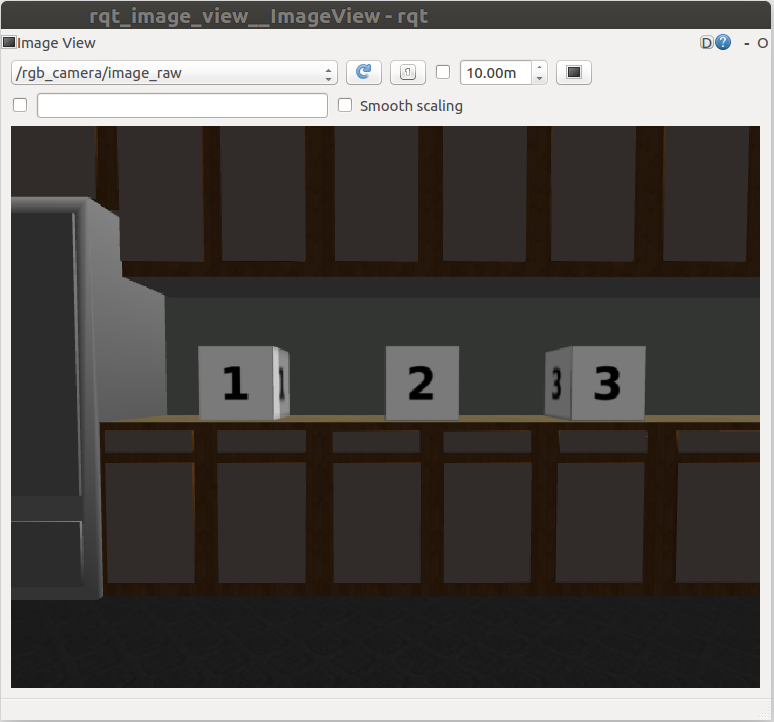
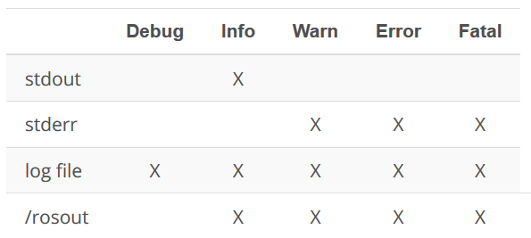
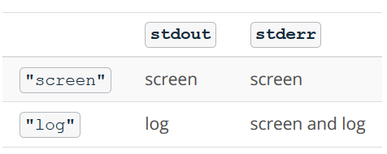

# Writing ROS Nodes

In [the previous lesson](https://github.com/A2Amir/Catkin-Workspace-for-ROS) I've created a Catkin workspace and added the simple arm package to it, 
In this lesson, I will be writing nodes in Python that publish and subscribe to topics and write a Ross service that can be called from other nodes or from the command line.

* The first node that I will be writing is called simple mover. The simple mover node does nothing more than publish joint angle commands to simple arm.

* The next node called arm mover. The arm mover node provides a service called safe move, which allows the arm to be moved to any position within its workspace, which has been deemed to be safe. The safe zone is bounded by minimum and maximum joint angles and it's configurable via the Ross parameter server.

* The last node I will write in this lesson, is the look away node.  This node subscribes to a topic where camera data is being published. When the camera detects an image with uniform color meaning that it's looking at the sky, the node will call the safe move service to move the arm to a new position.

# 1. ROS Publishers

### Defining Publishers

Before seeing the code for **simple_mover**, it may be helpful to see how ROS Publishers work in Python. Publishers allow a node to send messages to a topic, so that data from the node can be used in other parts of the ROS system. In Python, ROS publishers typically have the following definition format, although other parameters and arguments are possible:

    pub1 = rospy.Publisher("/topic_name", message_type, queue_size=size)

* **Synchronous publishing** means that a publisher will attempt to publish to a topic but may be blocked if that topic is being published to by a different publisher. In this situation, the second publisher is blocked until the first publisher has serialized all messages to a buffer and the buffer has written the messages to each of the topic's subscribers. This is the default behavior of a rospy Publisher **if the queue_size parameter is not used or set to None**.

* **Asynchronous publishing** means that a publisher can store messages in a queue until the messages can be sent. If the number of messages published exceeds the size of the queue, the oldest messages are dropped. **The queue size can be set using the queue_size parameter**.

### Using Publishers

Once the publisher has been created as above, a message with the specified data type can be published as follows:
	  
    pub1.publish(message)
 
Note:Choosing a good **queue_size** is somewhat subjective, setting queue_size=0 actually creates an infinite queue. This could lead to memory leakage if the messages are published faster than they are picked up. providing a little room for messages to queue without being too large, is a good choice.

### Simple Mover: [The Code](https://github.com/A2Amir/Writing-ROS-Nodes/blob/master/Code/simple_mover.py)

Below is the Explanation of the code for **[the simple_mover node](https://github.com/A2Amir/Writing-ROS-Nodes/blob/master/Code/simple_mover.py)**, followed by a step-by-step explanation of what is happening. 

First, open a new terminal, next: 

	1. cd ~/catkin_ws/src/simple_arm/
	2. mkdir scripts
	3. cd scripts
	4. touch simple_mover
	5. nano simple_mover

6. I have opened the simple_mover script with the nano editor, now copy 
	and paste the code from**[the simple_mover node](https://github.com/A2Amir/Writing-ROS-Nodes/blob/master/Code/simple_mover.py)** into the script and use ctrl-x followed by y then enter to save the script.

7. chmod u+x simple_mover
 
### The code: Explained


```python
#!/usr/bin/env python

import math
import rospy
from std_msgs.msg import Float64
```

rospy is the official Python client library for ROS. It provides most of the fundamental functionality required for interfacing with ROS via Python. It has interfaces for creating Nodes, interfacing with Topics, Services, Parameters and more. It will certainly be worth your time to check out the API documentation [here](http://docs.ros.org/kinetic/api/rospy/html/). General information about rospy, including other tutorials may be found on the [ROS Wiki](http://wiki.ros.org/rospy_tutorials/Tutorials/WritingPublisherSubscriber).


```python
from std_msgs.msg import Float64
```

From the std_msgs package, I import Float64, which is one of the primitive message types in ROS. The [std_msgs](http://wiki.ros.org/std_msgs) package also contains all of the other primitive types. Later on in this script, I will be publishing Float64 messages to the position command topics for each joint.


```python
def mover():
    pub_j1 = rospy.Publisher('/simple_arm/joint_1_position_controller/command',
                             Float64, queue_size= 10)
    pub_j2 = rospy.Publisher('/simple_arm/joint_2_position_controller/command',
                             Float64, queue_size=10)
```

At the top of the mover function, two publishers are declared, one for joint 1 commands, and one for joint 2 commands. Here, the queue_size parameter is used to determine the maximum number messages that may be stored in the publisher queue before messages are dropped. More information about this parameter can be found [here](http://wiki.ros.org/rospy/Overview/Publishers and Subscribers#queue_size:_publish.28.29_behavior_and_queuing).


```python
 rospy.init_node('arm_mover')
```

Initializes a client node and registers it with the master. Her **arm_mover** is the name of the node. init_node() must be called before any other rospy package functions are called. The argument anonymous=True makes sure that you always have a unique name for your node.


```python
 rate = rospy.Rate(10)
```

The rate object is created here with a value of 10 Hertz. Rates are used to limit the frequency at which certain loops (for example publishing at a frequency of 10Hz) spin in ROS . Choosing a rate which is too high may result in unnecessarily high CPU usage, while choosing a value too low could result in high overall system latency. Choosing sensible values for all of the nodes in a ROS system is a bit of a fine-art.


```python
start_time = 0

    while not start_time:
        start_time = rospy.Time.now().to_sec()

```

start_time is used to determine how much time has elapsed. When using ROS with simulated time (as I am doing here), rospy.Time.now() will initially return 0, until the first message has been received on the /clock topic. This is why start_time is set and polled continuously until a nonzero value is returned (more information [here](http://wiki.ros.org/rospy/Overview/Time)). 


```python

    while not rospy.is_shutdown():
        elapsed = rospy.Time.now().to_sec() - start_time
        pub_j1.publish(math.sin(2*math.pi*0.1*elapsed)*(math.pi/2))
        pub_j2.publish(math.sin(2*math.pi*0.1*elapsed)*(math.pi/2))
        rate.sleep()

```

This the main loop. Due to the call to rate.sleep(), the loop is traversed at approximately 10 Hertz. Each trip through the body of the loop will result in two joint command messages being published. The joint angles are sampled from a sine wave with a period of 10 seconds, and in magnitude from [−π/2,+π/2-\pi/2, +\pi/2−π/2,+π/2]. When the node receives the signal to shut down (either from the master, or via SIGINT signal in a console window), the loop will be exited.


```python
if __name__ == '__main__':
    try:
        mover()
    except rospy.ROSInterruptException:
        pass
```
If the name variable is set to “main”, indicating that this script is being executed directly, the mover() function will be called. The try/except blocks here are significant as rospy uses exceptions extensively. The particular exception being caught here is the ROSInterruptException. This exception is raised when the node has been signaled for shutdown. If there was perhaps some sort of cleanup needing to be done before the node shuts down, it would be done here. More information about rospy exceptions can be found [here](http://wiki.ros.org/rospy/Overview/Exceptions).

#### Running simple_mover code

Assuming that my workspace has recently been built and it’s setup.bash has been sourced, I can launch simple_arm as follows:

	cd ~/catkin_ws
	roslaunch simple_arm robot_spawn.launch
	
Once ROS Master, Gazebo, and all of our relevant nodes are up and running, I can finally launch simple_mover. To do so, open a new terminal and type the following commands:

	cd ~/catkin_ws
	source devel/setup.bash
	rosrun simple_arm simple_mover
	
Below is a gif showing what the expected movements should look like.

<p align="right">

<p align="center">

# 2. ROS Services

### Defining services

In this section I am going to code an another node called **arm_mover** which implements the **safe_move** service to allow the arm to be controlled with service calls.

A ROS service allows request/response communication between nodes. Within the node providing the service, request messages are handled by functions or methods. Once the requests have been handled successfully, the node providing the service sends a message back to the requester node. 

In Python, a ROS service can be created using the following definition format:

	service = rospy.Service('service_name', serviceClassName, handler)

Here, the **service_name** is the name given to the service. Other nodes will use this name to specify which service they are sending requests to. Each service has a definition provided in an .srv file. This is a text file that provides the proper message type for both requests and responses and the **serviceClassName** comes from this file name where the service definition exists.

The **handler** is the name of the function or method that handles the incoming service message. This function is called each time the service is called and the message from the service call is passed to the handler as an argument. The handler should return an appropriate service response message.


### Using Services

Services can be called directly from the command line and I will show you an example of this in the upcoming arm_mover concepts. On the other hand, to use a ROS service from within another node, I will define a ServiceProxy, which provides the interface for sending messages to the service:

	service_proxy = rospy.ServiceProxy('service_name', serviceClassName)

One way the ServiceProxy can then be used to send requests is as follows:

	msg = serviceClassNameRequest()
	response = service_proxy(msg)

In the code above, a new service message is created by calling the serviceClassNameRequest() method. This method is provided by rospy and its name is given by appending Request() to the name used for serviceClassName. Since the message is new, the message attributes should be updated to have the appropriate data. Next, the service_proxy can be called with the message and the response stored.

For other ways to pass data to service_proxy, see the ROS documentation [here](http://wiki.ros.org/rospy/Overview/Services).

### Description of Arm Mover

In many respects, arm_mover is quite similar to simple_mover. Like simple_mover, it is responsible for commanding the arm to move. However, instead of simply commanding the arm to follow a predetermined trajectory, the arm_mover node provides the service move_arm, which allows other nodes in the system to send movement_commands.

In addition to allowing movements via a service interface, arm_mover also allows for configurable minimum and maximum joint angles, by using parameters.


### Creating a new service definition

As learned earlier, an interaction with a service consists of two messages being passed. A request passed to the service, and a response received from the service. The definitions of the request and response message type are contained within .srv files living in the srv directory under the package’s root.

Let’s define a new service for simple_arm. I call it GoToPosition.

	cd ~/catkin_ws/src/simple_arm/
	mkdir srv
	cd srv
	touch GoToPosition.srv
	nano GoToPosition.srv
	
I should now add into GoToPosition.srv, following:
	
	float64 joint_1
	float64 joint_2
	---
	duration time_elapsed
	
Then use use ctrl-x followed by y then enter to save the script

**Service definitions always contain two sections, separated by a ‘---’ line.**

* The first section is the definition of the request message. Here, a request consists of two float64 fields, one for each of simple_arm’s joints. 

* The second section contains is the service response. The response contains only a single field, time_elapsed. The time_elapsed field is of type duration and is responsible for indicating how long it took the arm to perform the movement.

Note: Defining a custom message type is very similar, with the only differences being that message definitions live within the msg directory of the package root, have a “.msg” extension, rather than .srv, and do not contain the “---” section divider. You can find more detailed information on creating messages and services [here](http://wiki.ros.org/msg) and [here](http://wiki.ros.org/srv) respectively.

### Modifying CMakeLists.txt

In order for catkin to generate the python modules or C++ libraries which allow to utilize messages in my code I must first modify simple_arm’s CMakeLists.txt (~/catkin_ws/src/simple_arm/CMakeLists.txt).

	cd ~/catkin_ws/src/simple_arm/ 	
	nano   CMakeLists.txt

CMake is the build tool underlying catkin and CMakeLists.txt is nothing more than a CMake script used by catkin. If you’re familiar with GNU make and the concept of makefiles, this is a similar concept.

First, ensure that the find_package() macro lists std_msgs and message_generation as required packages. The find_package() macro should look as follows:

	find_package(catkin REQUIRED COMPONENTS
		std_msgs
		message_generation
	)
	
As the names might imply, the std_msgs package contains all of the basic message types, and message_generation is required to generate message libraries for all the supported languages (cpp, lisp, python, javascript). 
Next, uncomment the commented-out add_service_files() macro so it looks like this:

	## Generate services in the 'srv' folder
	add_service_files(
	   FILES
	   GoToPosition.srv
	)

This tells catkin which files to generate code for. Lastly, make sure that the generate_messages() macro is uncommented, as follows:

	generate_messages(
	   DEPENDENCIES
	   std_msgs  # Or other packages containing msgs
	)

This macro is actually responsible for generating the code. For more information about CMakeLists.txt check out [this page](http://wiki.ros.org/catkin/CMakeLists.txt) on the ROS wiki.


Then use use ctrl-x followed by y then enter to save the changes in the CMakeLists.txt file.

### Modifying package.xml

Now that the CMakeLists.txt file has been covered, I should technically be able to build the project. However, there’s one more file which needs to be modified, package.xml. package.xml is responsible for defining many of the package’s properties, such as the name of the package, version numbers, authors, maintainers, and dependencies.

When worring about the dependencies check in [the previous lesson](https://github.com/A2Amir/Catkin-Workspace-for-ROS), which was about build-time dependencies and run-time package dependencies. When **rosdep** is searching for these dependencies, it’s the package.xml file that is being parsed. Let’s add the message_generation and message_runtime dependencies.
	
	cd ~/catkin_ws/src/simple_arm/
	nano   package.xml
	add into package.xml the following:
	    
		 <build_depend>message_generation</build_depend>
 		 <run_depend>message_runtime</run_depend>
	   
	ue use ctrl-x followed by y then enter to save the script.
	   
You are now ready to build the package! For more information about package.xml, check out [he ROS Wiki](http://wiki.ros.org/catkin/package.xml)


### Building  the package

If I build the workspace successfully, I should now find that a python package containing a module for the new service GoToPosition has been created deep down in the devel directory.

	cd ~/catkin_ws
	catkin_make
	cd devel/lib/python2.7/dist-packages
	ls+
	
After sourcing the newly created setup.bash, the new simple_arm package has now become part of your PYTHONPATH environment variable, and is ready for use!

	cd ~/catkin_ws  	
	source  devel/setup.bash
	env | grep PYTHONPATH
	
### Creating the empty arm_mover node script

The steps I take to create the arm_mover node are exactly the same as the steps I took to create the simple_mover script, excepting the actual name of the script itself.

	cd ~/catkin_ws
	cd src/simple_arm/scripts (if there is no scripts folder, make it by using mkdir scripts then navigate to it by cd arm_monode/)
	touch arm_mover
	chmod u+x arm_mover
	
### Arm Mover: [The Code](https://github.com/A2Amir/Writing-ROS-Nodes/blob/master/Code/arm_mover.py)

	cd ~/catkin_ws
	cd src/simple_arm/scripts
	nano arm_mover
You have opened the arm_mover script with the nano editor, now copy and paste the code below from [this file](https://github.com/A2Amir/Writing-ROS-Nodes/blob/master/Code/arm_mover.py) into the arm_mover and use ctrl-x followed by y then enter to save the script.

### The code: explained

```python
#!/usr/bin/env python

import math
import rospy
from std_msgs.msg import Float64
from sensor_msgs.msg import JointState
from simple_arm.srv import *
```
The imported modules for arm_mover are the same as simple_arm, with the exception of two new imports. Namely, the JointState message and the simple_arm.srv module. JointState messages are published to the /simple_arm/joint_states topic and are used for monitoring the position of the arm. The simple_arm package and the srv module are automatically generated by catkin as part of the build process.


```python
def at_goal(pos_j1, goal_j1, pos_j2, goal_j2):
    tolerance = .05
    result = abs(pos_j1 - goal_j1) <= abs(tolerance)
    result = result and abs(pos_j2 - goal_j2) <= abs(tolerance)
    return resul
```
This function returns True if the joint positions are close to the goals. When taking measurements from sensors in the real world, there will always be some amount of noise. The same is true of the joint positions reported by the gazebo simulator. If both joint positions are within 0.05 radians of the goal, True is returned.

```python
def clamp_at_boundaries(requested_j1, requested_j2):
    clamped_j1 = requested_j1
    clamped_j2 = requested_j2

```
**clamp_at_boundaries()** is responsible for enforcing the minimum and maximum joint angles for each joint. If the joint angles passed in, are outside of the operable range, they will be “clamped” to the nearest allowable value.


```python
   min_j1 = rospy.get_param('~min_joint_1_angle', 0)
    max_j1 = rospy.get_param('~max_joint_1_angle', 2*math.pi)
    min_j2 = rospy.get_param('~min_joint_2_angle', 0)
    max_j2 = rospy.get_param('~max_joint_2_angle', 2*math.pi)
```
The minimum and maximum joint angles are retrieved from the parameter server each time clamp_at_boundaries() is called. The “~” is the [private namespace](http://wiki.ros.org/Names#Resolving) qualifier and indicates that the parameter we wish to get is within this node’s private namespace /arm_mover/ (e.g. ~min_joint_1_angle resolves to /arm_mover/min_joint_1_angle). The second parameter is the default value to be returned, in the case that rospy.get_param() was unable to get the parameter from the param server.
```python

if not min_j1 <= requested_j1 <= max_j1:
        clamped_j1 = min(max(requested_j1, min_j1), max_j1)
        rospy.logwarn('j1 is out of bounds, valid range (%s,%s), clamping to: %s',
                      min_j1, max_j1, clamped_j1)

    if not min_j2 <= requested_j2 <= max_j2:
        clamped_j2 = min(max(requested_j2, min_j2), max_j2)
        rospy.logwarn('j2 is out of bounds, valid range (%s,%s), clamping to: %s',
                      min_j2, max_j2, clamped_j2)

    return clamped_j1, clamped_j2
```
The rest of this function simply clamps the joint angle if necessary. Warning messages are logged if the requested joint angles are out of bounds.

```python
def move_arm(pos_j1, pos_j2):
    time_elapsed = rospy.Time.now()
    j1_publisher.publish(pos_j1)
    j2_publisher.publish(pos_j2)

    while True:
        joint_state = rospy.wait_for_message('/simple_arm/joint_states', JointState)
        if at_goal(joint_state.position[0], pos_j1, joint_state.position[1], pos_j2):
            time_elapsed = joint_state.header.stamp - time_elapsed
            break

    return time_elapsed
```
move_arm() commands the arm to move, returning the amount of time that elapsed while the arm was moving. 

Note: Within the function we are using the rospy.wait_for_message() call to receive JointState messages from the /simple_arm/joint_states topic. This is blocking function call, meaning that it will not return until a message has been received on the /simple_arm/joint_states topic.

In general,I simply use it here for the sake of clarity, and because move_arm is being called from the handle_safe_move_request() function, which demands that the response message is passed back as a return parameter. More discussion on this below.

```python
def handle_safe_move_request(req):
    rospy.loginfo('GoToPositionRequest Received - j1:%s, j2:%s',
                   req.joint_1, req.joint_2)
    clamp_j1, clamp_j2 = clamp_at_boundaries(req.joint_1, req.joint_2)
    time_elapsed = move_arm(clamp_j1, clamp_j2)

    return GoToPositionResponse(time_elapsed)
```
This is the service handler function. When a service client sends a GoToPosition request message to the safe_move service, this function is called. The function parameter req is of type GoToPositionRequest. The service response is of type GoToPositionResponse.

Note: move_arm() is blocking(by rospy.wait_for_message()) and will not return until the arm has finished its movement. Incoming messages cannot be processed and no other useful work can be done in the python script while the arm is performing it’s movement command. While this poses no real problem for this example, it is a practice that should generally be avoided. One great way to avoid blocking the thread of execution would be to use [Action](http://wiki.ros.org/actionlib). Here’s some [informative documentation describing](http://wiki.ros.org/ROS/Patterns/Communication#Communication_via_Topics_vs_Services_vs_X) when it’s best to use a Topic versus a Service, versus an Action.


```python
def mover_service():
    rospy.init_node('arm_mover')
    service = rospy.Service('~safe_move', GoToPosition, handle_safe_move_request)
    rospy.spin()
```
Here the node is initialized with the name “arm_mover”, and the GoToPosition service is created with the name “safe_move”. 
Lastly, rospy.spin() simply blocks until a shutdown request is received by the node. Failure to include this line would result in mover_service() returning and the script completing execution.

```python
if __name__ == '__main__':
    j1_publisher = rospy.Publisher('/simple_arm/joint_1_position_controller/command', Float64, queue_size=10)
    j2_publisher = rospy.Publisher('/simple_arm/joint_2_position_controller/command', Float64, queue_size=10)

    try:
        mover_service()
    except rospy.ROSInterruptException:
        pass

```
This section of code is similar, to that of simple_mover(). I've written the arm_mover node and the next step is to launch it and then test it out by interacting with the service via the command line!

### Launching the project with the new service

To get the **arm_mover** node, and accompanying **safe_move** service to launch along with all of the other nodes, you will modify **robot_spawn.launch**.

	Cd ~/catkin_ws/src/simple_arm/launch
	Nano robot_spawn.launch

To get the arm_mover node to launch, simply add the following:

	  <!-- The arm mover node -->cd ..
	  <node name="arm_mover" type="arm_mover" pkg="simple_arm">
	    <rosparam>
	      min_joint_1_angle: 0
	      max_joint_1_angle: 1.57
	      min_joint_2_angle: 0
	      max_joint_2_angle: 1.0
	    </rosparam>
	  </node>
	  
More information on the format of the launch file can be found [here](http://wiki.ros.org/roslaunch/XML).

### Testing the new service

Now that I've modified the launch file and I am ready to test everything out. To do so, launch the simple_arm, verify that the arm_mover node is running, and that the safe_move service is listed:

Note: You will need to make sure that you've exited out of your previous roslaunch session before re-launching.

	 cd ~/catkin_ws
	 catkin_make
	 source devel/setup.bash
	 roslaunch simple_arm robot_spawn.launch
	 
Then, in a new terminal, verify that the node and service have indeed launched.

	 rosnode list
	 rosservice list
	 
Assuming that both the service (/arm_mover/safe_move) and the node (/arm_mover) show up as expected (If they've not, check the logs in the **roscore** console), you can now interact with the service using **rosservice**.

To view the camera image stream, I can use the command **rqt_image_view** (you can learn more about rqt and the associated tools [here](http://wiki.ros.org/rqt)):
	
	rqt_image_view /rgb_camera/image_raw


<p align="right">

<p align="right">
	
### Adjusting the view

As seen above the camera is displaying a gray image. This is as to be expected, given that it is straight up towards the gray sky of my gazebo world. To point the camera towards the numbered blocks on the counter top, I would need to rotate both joint 1 and joint 2 by approximately pi/2 radians. Let’s give it a try:

	cd ~/catkin_ws/
	source devel/setup.bash
	rosservice  call /arm_mover/safe_move "joint_1: 1.57
	joint_2: 1.57"
	
Note: rosservice call can tab-complete the request message, so that you don’t have to worry about writing it out by hand. Also, be sure to include a line break between the two joint parameters.

Upon entering the command, I should be able to see the arm move and eventually stop, reporting the amount of time it took to move the arm to the console. This is as expected.

What was not expected is the resulting position of the arm. Looking at the roscore console, we can very clearly see what the problem was. The requested angle for joint 2 was out of the safe bounds. We requested 1.57 radians, but the maximum joint angle was set to 1.0 radians.
By setting the max_joint_2_angle on the parameter server, I should be able to bring the blocks into view the next time a service call is made. To increase joint 2’s maximum angle, I can use the command rosparam:
	
	
	rosparam set /arm_mover/max_joint_2_angle 1.57
	
Now I should be able to move the arm such that all of the blocks are within the field of view of the camera:

	rosservice call /arm_mover/safe_move "joint_1: 1.57
	joint_2: 1.57"
	
	rqt_image_view /rgb_camera/image_raw


<p align="right">

<p align="right">
	
As seen above all of the blocks are within the field of view.


# 3. ROS Subscribers


A Subscriber enables my node to read messages from a topic, allowing useful data to be streamed into the node. In Python, ROS subscribers frequently have the following format, although other parameters and arguments are possible:

	sub1 = rospy.Subscriber("/topic_name", message_type, callback_function)

* The **"/topic_name"** indicates which topic the Subscriber should listen to.
* The** message_type** is the type of message being published on **"/topic_name"**.
* The **callback_function** is the name of the function that should be called with each incoming message. Each time a message is received, it is passed as an argument to callback_function. Typically, this function is defined in your node to perform a useful action with the incoming data. 

Note that unlike service handler functions, the callback_function is not required to return anything.For more information about subscribers, see the documentation [here](http://docs.ros.org/api/rospy/html/rospy.topics.Subscriber-class.html). Let's move on to the look_away node so you can see subscribers in action!

### Look Away node

To see a Subscriber in action, I will write a node called **look_away**. The look_away node will subscribe to **the /rgb_camera/image_raw topic**, which has image data from the camera mounted on the end of the robotic arm. Whenever the camera is pointed towards an uninteresting image - in this case, an image with uniform color - the callback function will move the arm to something more interesting. 

### Creating the empty look_away node script

	cd ~/catkin_ws
	cd src/simple_arm/scripts(if there is no scripts folder, creat it with mkdir scripts and navigate to it with cd scripts)
	touch look_away
	chmod u+x look_away
	nano look_away
	
You have opened the look_away script with the nano editor, now copy and paste the code below from [this file](https://github.com/A2Amir/Writing-ROS-Nodes/blob/master/Code/look_away.py) into the script and use ctrl-x followed by y then enter to save the script.

### [The code](https://github.com/A2Amir/Writing-ROS-Nodes/blob/master/Code/look_away.py): explained

```python
#!/usr/bin/env python

import math
import rospy
from sensor_msgs.msg import Image, JointState
from simple_arm.srv import *
```

The imported modules are similar to those in simple_arm, except this time, we have the Image message type being imported so that the camera data can be used.

#### The LookAway Class and __init__ method

```python
class LookAway(object):
    def __init__(self):
        rospy.init_node('look_away')

        self.sub1 = rospy.Subscriber('/simple_arm/joint_states', 
                                     JointState, self.joint_states_callback)
        self.sub2 = rospy.Subscriber("rgb_camera/image_raw", 
                                     Image, self.look_away_callback)
        self.safe_move = rospy.ServiceProxy('/arm_mover/safe_move', 
                                     GoToPosition)

        self.last_position = None
        self.arm_moving = False

        rospy.spin()

```
I define a class for this node to better keep track of the robot arm's current movement state and position history. Just as in the node definitions before, the node is initialized using ropsy.init_node, and at the end of the method rospy.spin() is used to block until a shutdown request is received by the node.

The first subscriber, ** self.sub1**, subscribes to **the /simple_arm/joint_states topic** to keep track changes in the position of the arm.

The second subscriber, **self.sub2**, subscribes to **the /rgb_camera/image_raw topic**. The message type here is Image and with each message, the look_away_callback function is called.

A **ServiceProxy **is how rospy enables calling a service from a node. The ServiceProxy here is created using the name of the service I wish to call along with the service class definition: in this case **/arm_mover/safe_move and GoToPosition**.


#### The helper methods

```python
    def uniform_image(self, image):
        return all(value == image[0] for value in image)

    def coord_equal(self, coord_1, coord_2):
        if coord_1 is None or coord_2 is None:
            return False
        tolerance = .0005
        result = abs(coord_1[0] - coord_2[0]) <= abs(tolerance)
        result = result and abs(coord_1[1] - coord_2[1]) <= abs(tolerance)
        return result
```

There are two helper methods defined in the code: uniform_image and coord_equal. The uniform_image method takes an image as input and checks if all color values in the image are the same as the value of the first pixel. This essentially checks that all the color values in the image are the same.

The coord_equal method returns True if the coordinates coord_1 and coord_2 have equal components up to the specified tolerance. 

#### The callback functions


```python
def joint_states_callback(self, data):
        if self.coord_equal(data.position, self.last_position):
            self.arm_moving = False
        else:
            self.last_position = data.position
            self.arm_moving = True

    def look_away_callback(self, data):
        if not self.arm_moving and self.uniform_image(data.data):
            try:
                rospy.wait_for_service('/arm_mover/safe_move')
                msg = GoToPositionRequest()
                msg.joint_1 = 1.57
                msg.joint_2 = 1.57
                response = self.safe_move(msg)

                rospy.logwarn("Camera detecting uniform image. \
                               Elapsed time to look at something nicer:\n%s", 
                               response)

            except rospy.ServiceException, e:
                rospy.logwarn("Service call failed: %s", e)
```
The look_away_callback is receiving data from the /rgb_camera/image_raw topic. The first line of this method verifies that the arm is not moving and also checks if the the image is uniform. If the arm isn't moving and the image is uniform, then a GoToPositionRequest() message is created and sent using the safe_move service, moving both joint angles to 1.57. The method also logs a message warning you that the camera has detected a uniform image along with the elapsed time to return to a nicer image.

### Updating the launch file


Just as I did with the arm_mover node, to get look_away to launch with the rest of the nodes, I will need to modify robot_spawn.launch, which can be found in ~/catkin_ws/src/simple_arm/launch. modify robot_spawn.launch by:

	Cd ~/catkin_ws/src/simple_arm/launch
	nano robot_spawn.launch
	add the following code
		<!-- The look away node -->
		 <node name="look_away" type="look_away" pkg="simple_arm"/>

       use ctrl-x followed by y then enter to save it.
       
Note: While editing this file, it will be helpful to set max_joint_2_angle: 1.57 in arm_mover so that it isn't necessary to set it again from the command line.

### Launch and Interact
I can now launch and interact with simple_arm just as before:

	cd ~/catkin_ws
	catkin_make
	source devel/setup.bash
	roslaunch simple_arm robot_spawn.launch

**Please note that if you are having trouble with roslaunch simple_arm robot_spawn.launch please try the safe_spawner.sh script in the scripts folder. You can launch by using  ./safe_spawner.sh in a terminal of your choice.**

After launching, the arm should move away from the grey sky and look towards the blocks. To view the camera image stream, I can use the same command as before:

	rqt_image_view /rgb_camera/image_raw

To check that everything is working as expected, I open a new terminal, source devel/setup.bash, and send a service call to point the arm directly up towards the sky (note that the line break in the message is necessary):

	rosservice call /arm_mover/safe_move "joint_1: 0
	joint_2: 0"
	
As seen the Look Away node move it back towards the blocks.


# 4. Logging overview
In the code for the simple_mover, arm_mover and look_away nodes, I used lot of logging statements. Rospy has several message levels and provides a variety of options for how to display or store these messages:

	rospy.logdebug(...)
	rospy.loginfo(...)
	rospy.logwarn(...)
	rospy.logerr(...)
	rospy.logfatal(...)

All levels of logging messages are recorded in ROS log files, but some message levels may also be sent to Python **stdout**, Python **stderr**, or the ROS topic **/rosout**. The following table summarizes the default locations log messages are written to (source [here](http://wiki.ros.org/rospy/Overview/Logging)):


<p align="right">

<p align="right">

### Filtering and saving log messages from /rosout

Note that for messages written to /rosout, I can see the messages in real time as your program is running by echoing: 

	rostopic echo /rosout

Although it can be helpful to view messages this way, because of the volume of messages written to that topic, it can sometimes be helpful to filter messages by piping them to [grep](https://en.wikipedia.org/wiki/Grep). These grepped messages can also be saved to a file for debugging:

	rostopic echo /rosout | grep insert_search_expression_here
	

	rostopic echo /rosout | grep insert_search_expression_here > path_to_output/output.txt
	
	
### Modifying message level sent to /rosout

Based on the summarized table above, logdebug messages are not written to **/rosout** by default, it is possible to modify the level of logging messages written to /rosout to display them there, or change the level of logging messages written to /rosout to be more restrictive. To do this I must set the log_level attribute within the rospy.init_node code. For example, if I'd like to allow lodebug messages to be written to /rosout, that can be done as follows:

	rospy.init_node('my_node', log_level=rospy.DEBUG)
	
Other possible rospy options for log_level are INFO, WARN, ERROR, and FATAL.

### Modifying display of messages sent to stdout and stderr

It is also possible to change how messages to stdout and stderr are displayed or logged. Within a package's .launch file, the output attribute for a node tag can be set to "screen" or "log". The following table summarizes how the different output options change the display of the node's stdout and stderr messages:

<p align="right">

<p align="right">


For example, setting output="screen" for the look_away node in robot_spawn.launch will display both stdout and stderr messages in the screen:
  <!-- The look away node -->
  <node name="look_away" type="look_away" pkg="simple_arm" output="screen"/>
If the output attribute is left empty, the default is "log".

```python

```

```python

```
